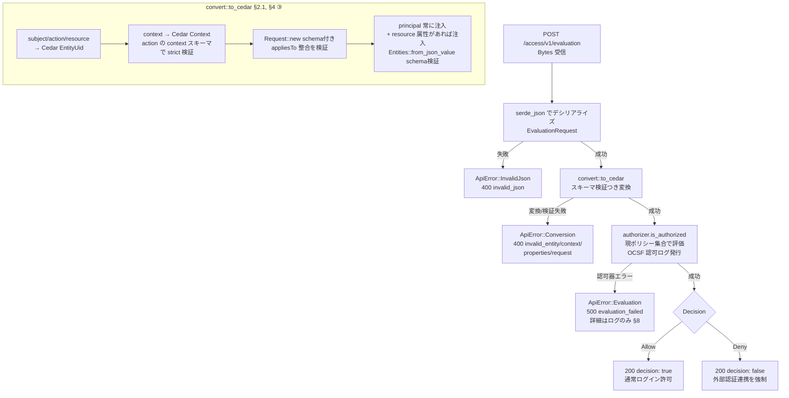
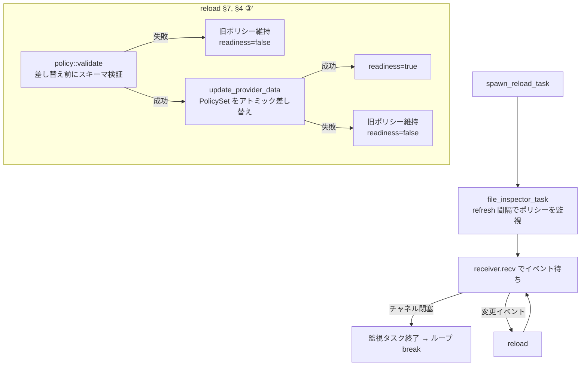

# AuthZEN 準拠 認可サイドカー — 設計検討書 (Draft)

`cedar-local-agent` を用いて、OpenID AuthZEN Authorization API 1.0 準拠の
認可サイドカー（Policy Decision Point / PDP）を構築するための設計事項を整理する。

- 対象仕様: **AuthZEN Authorization API 1.0**（2026-06-25 公開, Standards Track）
- 基盤: `cedar-local-agent` 3.0.0 / `cedar-policy` 4.2
- 現状: `examples/authzen-server` に Access Evaluation 単体エンドポイントの最小実装あり

---

## 1. 目的・ユースケース

**ECS 上で動作する Keycloak のサイドカー**として常駐し、Keycloak の認証フロー中に
AuthZEN HTTP API 経由で認可判定（PDP）を返す。

### 1.1 具体ユースケース: 外部認証連携の強制可否判定

- Keycloak は認証（AuthN）の途中で、本サイドカー（PDP）に「このユーザは**外部認証連携
  （external IdP federation / step-up）を強制すべきか**」を問い合わせる。
- 判定は **Keycloak クライアント単位のポリシー**と、**Keycloak から送られるユーザ属性**に
  基づく。例: 「特定グループのユーザ、または社外ドメインのユーザは、クライアント X への
  ログイン時に外部 IdP 連携を強制」。
- 本サイドカーは判定（強制する/しない）を返すだけ。実際の連携実行は Keycloak 側。

### 1.2 役割分担

- **Keycloak = 認証（AuthN）かつ PEP**: ユーザ認証、ユーザ属性の保有、認証フローからの
  PDP 呼び出し、判定に基づく外部連携の実行。
- **本サイドカー = 認可判定（PDP）**: Cedar による属性ベースの判定のみ。

### 1.3 非機能要件

- **低レイテンシ**: ロードしたポリシーはインメモリで保持する。
- **ポリシーの無停止更新**: S3上に配置するポリシーファイルが更新されたらホットリロードされる。
- **可観測性**: ヘルス、構造化ログ（CloudWatch）、OCSF 認可監査ログ。
- **設定駆動**: ポリシーファイルの場所など環境依存の設定項目は環境変数化する。
- **安全側デフォルト**: 入力検証、サイズ制限、最小権限 IAM、localhost バインド。

---

## 2. API サーフェスと Cedar マッピング

このユースケースは**単一判定**で完結するため、MVP は **Access Evaluation + Metadata** に
絞る。Batch / Search は対象外（将来必要になれば §補遺）。

| # | API | Method | Path | 公開/非公開 | 開発対象 |
|---|-----|--------|------|------------|---------|
| 1 | Access Evaluation | `POST` | `/access/v1/evaluation` | 非公開（内部） | ◯ |
| 2 | Metadata / Discovery | `GET` | `/.well-known/authzen-configuration` | 公開 | ◯ |
| 3 | Access Evaluations (batch) | `POST` | `/access/v1/evaluations` | — | 対象外 |
| 4 | Subject/Resource/Action Search | `POST` | `/access/v1/search/*` | — | 対象外（§補遺 A） |

### 2.1 リクエスト → Cedar マッピング（本ユースケース固有）

| AuthZEN | Cedar | 出所 / 例 |
|---|---|---|
| `subject.type`+`id` | `principal = User::"<sub>"` | Keycloak: `sub` / `preferred_username` |
| `subject.properties` | principal エンティティ属性（ABAC） | `user_type`, `department` 等 |
| `action.name` | `action = Action::"login"` | 固定（問い合わせ＝ログイン可否） |
| `resource.type`+`id` | `resource = Client::"<clientId>"` | Keycloak: 認証中の client |
| `context` | Cedar `Context` | 環境属性 `access_route` 等 |

設計上の要点:

- **属性の置き場所を分ける**（§2.3 のポリシー例に整合）:
  - principal 側（`subject.properties` → 注入）: `user_type`, `department` 等、**ユーザ自身**の属性。
  - context 側: `access_route`（internet/internal）等、**リクエスト環境**の属性。
- **エンティティ衝突（§4 ②）の回避**: principal に属性を注入しても、本設計は**静的エンティティ
  ストアを持たない**（空の `EntityProvider`）ため同 uid 衝突は起きない。ユーザは Keycloak から
  リクエスト毎に与えられ、ストアには存在しない。
- **判定の向き（本ユースケースの規約）**: アクションは `login`。
  - **`Deny`（`forbid` 一致）= 外部認証連携を強制する**（通常ログインを許さず外部 IdP 連携へ）。
  - **`Allow`（`permit` のみ・`forbid` 不一致）= 通常ログインを許可**（強制しない）。
  - 「外部認証連携強制用のポリシー」は **`forbid(... action == Action::"login" ...)`** で書く
    （§2.3）。`@id("allow-login")` の包括 `permit` を基底に、危険な条件で `forbid` が上書きする
    （Cedar は `forbid` 優先）。
  - 規約は **Deny=強制 に確定**（2026-06-30）。Keycloak 側の分岐実装もこれに合わせる
    （初版の暫定案 `Allow=強制` を反転したもの）。
- **クライアント毎ポリシー**: `resource == Client::"<clientId>"` で条件化（§2.3, §5.2 案1）。
- **アクションは拡張可能**: 当面 `login` の1種だが、**許可アクション集合は schema で定義**するため
  `requireMfa` 等の追加は schema＋ポリシー更新で済み、コード変更は不要。convert/検証はアクションを
  ハードコードせず schema 由来の集合で判定する。

### 2.2 リクエスト/レスポンス例

```http
POST /access/v1/evaluation
{
  "subject":  { "type": "User", "id": "u-123",
                "properties": { "user_type": "employee", "department": "A1" } },
  "action":   { "name": "login" },
  "resource": { "type": "Client", "id": "a-client" },
  "context":  { "access_route": "internet" }
}
```

```json
{ "decision": false }   // a-client-deny に一致 → Deny = 外部認証連携を強制
```

#### レスポンス `context`（アノテーションマッピング）

AuthZEN のレスポンスは `decision` に加えて任意の JSON オブジェクト `context` を返せる。
本 PDP は、**判定を決めたポリシー**（Cedar の `diagnostics().reason()`）に付いた
`@decision_context_<key>("value")` アノテーションを `context.<key> = "value"` にマッピングして返す。
PEP（Keycloak authenticator 等）へ「なぜ拒否されたか」「どの追加認証を要求すべきか」を
ポリシー側から伝えるための仕組み。

```cedar
@id("a-client-deny")
@priority("100")
@decision_context_reason_user("追加認証が必要です")
@decision_context_step_up("external-auth")
forbid(principal, action == Action::"login", resource == Client::"a-client")
when { ... };
```

```json
{
  "decision": false,
  "context": { "reason_user": "追加認証が必要です", "step_up": "external-auth" }
}
```

マッピング規約:

- 対象は `decision_context_` プレフィックス付きアノテーションのみ。`@id`・`@priority` など
  他のアノテーションはレスポンスに漏らさない。値は Cedar アノテーションの制約上、常に文字列。
- 対象ポリシーは determining policies のみ。default-deny（`forbid` 不一致の拒否）では
  `reason()` が空になるため `context` は付かない。`permit`/`forbid` どちらの
  アノテーションも対象（`decision: true` でも返しうる）。
- **determining policies が複数ある場合、アノテーションを採用するのは 1 ポリシーだけ**。
  `@priority` の昇順（値が小さいほど優先。未指定は最低優先度）で選び、同値は `@id` の
  文字列順で先勝ちとする。キー単位のマージはしない。理由文（`reason_user`）と次アクション
  （`step_up`）が別ポリシー由来で合成されると、単独では意味の通らない `context` になるため。
  採用ポリシーは監査ログの `context_policy` フィールドに出す。
- 選ばれたポリシーが `@decision_context_*` を 1 つも持たない場合、**下位のポリシーには
  フォールバックしない**。理由を明かさない高優先度の `forbid` が、下位ポリシーの無関係な
  文言を引き連れる事故を防ぐため（後述の予約フィールドは通常どおり付与される）。
- `@priority` の値は非負整数のみ。不正値を含むポリシーセットはロード時に拒否する
  （起動時は fail-fast、リロード時は反映拒否＋not-ready。§4 ③', §7, §10 の schema 検証と同じ扱い）。
- `@priority` は `context` の出所選択にのみ影響し、**Cedar の Allow/Deny 判定には一切影響しない**
  （`forbid` 優先という Cedar の評価規則はそのまま）。
- 該当アノテーションが 1 つもなければ（かつ後述の予約フィールドも空なら）`context`
  フィールド自体を省略する。

##### PDP 予約フィールド（`reason` / `errors`）

アノテーション由来のキーに加え、PDP は cedar-local-agent の応答情報を以下の**予約キー**で
`context` に付与する（`src/convert.rs` `build_context`）。

- `reason`: determining policies（`diagnostics().reason()`）の可読 id（`@id`、無ければ内部 id）
  の**文字列配列**。空（default-deny 等）なら付与しない。
- `errors`: 評価時に発生し無視されたポリシーのエラー文字列（`diagnostics().errors()`）の**配列**。
  空なら付与しない。

```json
{
  "decision": false,
  "context": {
    "reason_user": "追加認証が必要です",     // アノテーション由来
    "step_up": "external-auth",
    "reason": ["a-client-deny", "b-client-deny"], // PDP 予約（複数 forbid 一致時は全件）
    "errors": []                              // ← 空なら省略。ここでは説明用
  }
}
```

- `reason` / `errors` は**予約キー**。作者が `@decision_context_reason` /
  `@decision_context_errors` を定義しても PDP 値で上書きする（衝突は warn ログに記録）。
- `reason` は `@id` を PEP に露出する（監査 id をレスポンスに載せる方針変更）。`errors` は
  ポリシー評価エラー文字列を含むため、内部情報が PEP に渡りうる点に留意（従来はログのみ）。
- **`reason` は determining policies を全件並べる**のに対し、アノテーション由来のキーは
  `@priority` 最優先の 1 ポリシーからしか来ない。上の例では `reason` に 2 件並ぶが、
  `reason_user` / `step_up` はそのうち優先度の高い方の値である。

ポリシー作者向けの規約（アノテーション `@id`/`@description`/`@priority`/`@decision_context_*` の
使い分け、命名、`decision` の用途別マッピング、新用途の追加手順）は
[`policies/README.md`](./policies/README.md)（ポリシー定義ルール）にまとめる。

### 2.3 ポリシー例（外部認証連携の強制）

「外部認証連携を強制するか」は `Action::"login"` への `permit`/`forbid` で表現する。基底の
包括 `permit` で通常ログインを許可し、**強制したい条件をクライアント別 `forbid`** で上書きする
（Cedar は `forbid` が常に優先）。以下はサイドカーが読む `policies.cedar` の例
（Keycloak/AVP 風の `{id, content}` 表現は、`@id(...)` 注釈付き Cedar テキストに対応する）。

```cedar
@id("allow-login")
permit(principal, action == Action::"login", resource);

// a-client: 「employee かつ 部署 A* かつ インターネット経路」のとき外部連携を強制
@id("a-client-deny")
forbid(principal, action == Action::"login", resource == Client::"a-client")
when {
  principal has user_type && principal.user_type == "employee" &&
  principal has department && principal.department like "A*" &&
  context has access_route && context.access_route == "internet"
};

// b-client: 「partner かつ 内部経路」のとき外部連携を強制
@id("b-client-deny")
forbid(principal, action == Action::"login", resource == Client::"b-client")
when {
  principal has user_type && principal.user_type == "partner" &&
  context has access_route && context.access_route == "internal"
};
```

ポイント:

- `principal has X &&` の**ガード**で属性欠落に備える。欠落時は条件 false → `forbid` 不発 →
  `permit` のまま **Allow＝強制しない**。属性の付与は**アプリ（Keycloak）側で担保**する前提のため、
  サイドカーでは属性欠落を弾かない（§4 ④, §8）。
- `department like "A*"` のようにワイルドカード一致が使える。
- 属性の出所: `user_type` / `department` は principal（`subject.properties`）、`access_route` は
  context（§2.1）。
- クライアント追加は `forbid(... resource == Client::"<new>")` を追記するだけ（§5.2 案1）。

---

## 3. アーキテクチャ（ECS / Keycloak サイドカー）

```
        ┌──────────────────── ECS Task (awsvpc) ────────────────────┐
        │                                                            │
        │   ┌──────────────┐    localhost     ┌──────────────────┐   │
 user ─►│   │   Keycloak    │ ───────────────► │  authz-sidecar    │   │
        │   │  (AuthN/PEP)  │  POST /access/   │  (this, PDP)      │   │
        │   │   custom      │ ◄─────────────── │  axum + cedar     │   │
        │   │ Authenticator │   {"decision"}   │  local-agent     │   │
        │   └──────────────┘                  └────────┬─────────┘   │
        │                                              │ read (NFS)   │
        │                                     ┌────────▼─────────┐    │
        │                                     │ S3 Files mount   │    │
        │                                     │ /mnt/s3files/    │    │
        │                                     │   policies.cedar │    │
        │                                     └────────┬─────────┘    │
        └──────────────────────────────────────────────┼─────────────┘
                                       背景同期(S3 Event Notifications) ▲▼
                                          S3 (Versioning 有効) バケット
                                          s3://bucket/prefix/policies.cedar
```

- **同一 ECS タスク**に Keycloak と本サイドカーを同居。`awsvpc` ネットワークモードで
  両コンテナはネットワーク名前空間を共有 → **`127.0.0.1` で通信**。
- Keycloak 側の呼び出しは **カスタム Authenticator SPI（Java）** で実装（認証フローに
  挿入し、PDP のレスポンスで外部 IdP リダイレクタへ分岐 or スキップ）。これは Keycloak 側の
  実装であり本リポジトリの対象外だが、**AuthZEN リクエスト契約（§2.1）が両者のインタフェース**。
- ポリシーは **S3 Files でマウントした S3 バケット**を、既存の `file::PolicySetProvider` が
  ファイルとして読む。更新は S3 の背景同期 + `file_inspector_task` の差分検知でホットリロード（§5）。
  schema（`schema.cedar.json`）も同マウントに置き、起動時に読む（§5.2, §6, §8）。

レイヤ構成（コードモジュール）案:

- `config`        — 環境変数からの設定ロード
- `authzen`       — AuthZEN serde 型（request/response/error/metadata）
- `convert`       — AuthZEN → Cedar 変換（属性の principal/context 振り分け + schema 入力検証）
- `handlers`      — `evaluation` / `metadata` / `healthz` / `readyz`
- `observability` — tracing / OCSF / リロード成否フラグ（readiness 用, §10）
- `main`          — 起動・ルーティング・graceful shutdown・更新タスク起動・`health` サブコマンド

ポリシー供給は**ライブラリ既存の `file::PolicySetProvider` + `events`（`file_inspector_task` /
`update_provider_data_task`）をそのまま利用**し、独自 Provider モジュールは持たない（§5）。

### 3.1 コード配置（確定）

- **独立バイナリ crate に昇格**し、ライブラリとは分離する。リポジトリ直下に
  `authzen-pdp/`（package 名 `authzen-pdp`）を置く（`examples/` 配下ではない）。
- **依存は crates.io 公開版** `cedar-local-agent = "3"`（path 依存ではない）。ライブラリは
  改変せず as-is で利用するため結合を避け、将来の別リポジトリ分離もしやすくする。
- プロトタイプ `examples/authzen-server/`（`main.rs` / `authzen.rs` / `convert.rs`）を新 crate の
  出発点として移植し、上記モジュール構成に再編する。本設計書も新 crate 直下へ移す。
- ルート `Cargo.toml` はライブラリ単一 package（`[workspace]` なし）。新 crate は `examples/*` と
  同様に**独立 cargo プロジェクト**として並置する（workspace 化はしない）。

---

## 4. cedar-local-agent 実挙動メモ（ソース／`tests/lib.rs` 精読で確認）

設計判断の前提となる、ライブラリの**実際の**挙動。README の記述より優先。

- **① プロバイダは Request を無視して全件返す**: `file::*Provider` は構築時にファイル全体を
  読み `RwLock<Arc<...>>` に保持し、`get_*` は Request に関係なく**常に全件**返す。
  本設計では S3 Files マウント上のポリシーを**この file プロバイダでそのまま読む**ため、
  「全件返す」挙動は変わらない（本ユースケースは全ポリシー評価で足りる）。

- **② リクエスト時エンティティはストアと衝突するとエラー**: `is_authorized` 内の
  `Entities::from_entities(fetched.chain(input), None)` は cedar 4.x の検証強化により
  **重複 uid でエラー**（`AuthorizerError::General` → 500）。
  `tests/lib.rs::authorize_with_duplicated_input_entities_should_panic` が実証。
  README の「last-value-wins」は**現行版では成立しない**。
  → 本設計は**静的エンティティストアを持たない**（空の `EntityProvider`）ため、principal に属性を
  注入しても同 uid 衝突は起きず、この問題を回避（§2.1）。

- **③ 評価時にスキーマ検証されない（→ 本設計は convert 層で自前検証）**:
  `is_authorized` は cedar 評価にスキーマを渡さないため、ライブラリ任せだと未知の
  type/action/属性は 400 にならず単に Deny に倒れる。
  → 本設計は **schema を採用**し、convert 層で `Request::new(..., Some(&schema))` と
  `Context::from_json_value(..., Some((&schema, &action)))` により入力を検証。
  未知の type/action/属性は **400** で弾く（§8）。評価自体は従来どおり schema 不使用。

- **③' ポリシーは評価前（ロード時）に schema で型検証する**:
  `PolicySetProvider` は**構文（パース）しか検証しない**。本設計はこれに加え、
  `Validator::new(schema).validate(policy_set, Strict)` による**ストリクト型検証**を
  自前で行う。schema に無い type/属性/action を参照するポリシー（例: `principal.bogus`）を
  ロード時に検出する。**起動時は fail-fast**、**リロード時は反映前に検証して不合格なら
  旧ポリシーを維持**（§7, §10）。これにより「構文は正しいが schema 不整合」なポリシーが
  live になることはない。

- **④ 属性欠如＝`forbid` 不発 → Allow（=強制しない）**:
  ポリシーの `principal has X && ...` ガードにより、属性（principal/context）が欠けると
  `forbid` の `when` が false → **不発**となり、基底の `permit` が残って **Allow＝強制しない**。
  **「強制すべきだったのに属性欠落で強制されない」フェイルオープン**に当たるが、属性付与は
  **アプリ（Keycloak）側で担保**する前提のため、サイドカーでは弾かない（§8）。

- **⑤ malformed データの扱い**: 構築時 malformed（構文エラー／読取失敗／**schema 型検証失敗**, ③'）は
  **起動失敗**（fail-fast）。起動後のリロードで malformed／schema 不整合になった場合は `error!` ログのみで
  **旧データ継続**（fail-static）。→ S3 上のポリシーを壊しても即死はしないが、更新が無言で無視されるため
  アラート必須（§7）。

---

## 5. ポリシーストア（S3 Files マウント）の設計

ポリシーは **Amazon S3 Files**（EFS 基盤で S3 バケットを NFS 4.1/4.2 のファイルシステムとして
提供するマネージドサービス。Mountpoint/FUSE とは別物）で ECS タスクにマウントし、
**ライブラリ既存の `file::PolicySetProvider` + `file_inspector_task` でそのまま読む**。
S3 用のカスタム Provider や `aws-sdk-s3` 依存は**不要**。

### 5.1 構成とデータフロー

```
管理者 → S3 バケットの policies.cedar を直接更新（PutObject）
       → S3 Event Notifications → S3 Files が常駐ファイルを更新
       → サイドカーの file_inspector_task が SHA256 差分を検知
       → update_provider_data_task が PolicySetProvider をリロード
```

- **起動時**: `file::PolicySetProvider::new(policy_set_path = "/mnt/s3files/policies.cedar")` が
  マウント上のファイルを読み `RwLock<Arc<PolicySet>>` にキャッシュ。
  malformed / 読取失敗なら**起動失敗（fail-fast、§4 ⑤）**。
- **評価時**: `get_policy_set` は**メモリ**から返す → per-request の認可は NFS 状態に非依存。
  NFS 障害時も旧ポリシーで継続（fail-static）。
- **更新時**: `file_inspector_task`（`RefreshRate`、既定 15〜30s）が定期的にファイルを読み
  SHA256 で差分検知 → 変化時のみ `update_provider_data` で再パース・swap。失敗は旧データ継続。
- **reload レイテンシ** ≈ S3 イベントの FS 反映（数秒）+ ポーリング間隔（15〜60s）。

制約・前提（重要）:

- **S3 Versioning が必須**（S3 Files の要件。リンクするバケットで有効化）。
- **常駐維持が前提**: S3 Files は未読データ（既定 30 日）を高性能ストレージから退避し、
  退避中のファイルはバケット直接更新が**自動反映されない**（次アクセス時に取得）。
  本設計では `file_inspector_task` が継続的に読むためポリシーファイルは常駐し続け、
  イベント駆動の自動反映が効く。退避は実質起きない。
- **read 専用**: サイドカーはマウントへ書き込まない → S3 Files の conflict / lost+found /
  export は無関係。マウントは read-only（§9）。
- **flock over NFS**: `file_inspector_task` は読取前に `fs2::lock_shared()`（flock）を取得する。
  NFSv4 でサポートされるはずだが、実環境での動作確認を検証項目とする（§13, §12）。

代替案（採らない）:

- **カスタム `S3PolicySetProvider`（`aws-sdk-s3` で `GetObject`+ETag+clock ポーリング）**:
  S3 Files を使わない/使えない場合の選択肢。実装・依存が増え、変更検知も自前。本案では不採用。

### 5.2 ポリシーのレイアウト

- **案1（MVP）: 単一ファイルに全クライアント分** `/mnt/s3files/policies.cedar`
  各ポリシーを `forbid(... resource == Client::"X" ...)` でクライアント別に条件化（§2.3）。
  Cedar が該当分のみ評価。読取は1ファイルで単純。クライアント追加＝ファイル追記。
- **案2（将来・想定済み）: 複数ファイル**（クライアント毎など）例 `policies/<clientId>.cedar`
  **ポリシーファイルは将来複数になる前提**で、loader はそれを見越して抽象化しておく
  （例: 設定パスをディレクトリ可とし配下の `*.cedar` を読み `PolicySet` をマージ）。
  ただし `file::PolicySetProvider` は単一ファイル前提なので、複数化時は
  「①外部処理で連結し1ファイル化」か「②複数読み込み＋マージするカスタム `SimplePolicySetProvider`」
  が要る。MVP は案1としつつ、移行を妨げない構成にする。
- **schema**: 同マウントに `schema.cedar.json` を併置し、起動時にロード（§6, §8）。

### 5.3 S3 Files / IAM 要件

- **S3 Files リソース**: file system、VPC 内の **mount target（AZ 毎に最大1）**、access point を
  プロビジョン。ECS タスク（`awsvpc`）から mount target への **NFS 経路（SG で TCP 2049 許可）**。
- **暗号化**: S3 Files は転送中 TLS / 保存時 KMS（既定 AWS 所有キー、CMK 可）。
- **権限**: ポリシー読取はファイルシステム経由のため、アプリ側に `s3:GetObject` の IAM は不要。
  S3 Files のマウント/アクセスポイント権限と、リンク先バケットの Versioning 有効化が前提。

### 5.4 ローカルでの再現（dev）

PDP はストレージ非依存（ただのファイルパスを read）なので、本番の S3 ポリシーストアは
**FUSE もクラウドも使わず**ローカル再現できる。`demo/s3-policy-store/`（docker compose）で:

- **MinIO** = S3 バケットの代役（Versioning 有効化）。
- **`mc mirror --watch`** の射影プロセス = S3 Files（バケット → 常駐ファイルへの射影）の代役。
- **authzen-pdp** は本番と同一バイナリ・同一 env で、射影先ファイルを read するだけ。

「MinIO に PutObject → 射影 → `file_inspector_task` が検知 → ホットリロード」という本番と
同じ更新フローを実演できる（手順は同ディレクトリの README）。

---

## 6. 設定（環境変数）

12-factor 風に環境変数で外部化（ECS のタスク定義／SSM／Secrets Manager から注入）。

| 変数 | 既定 | 説明 |
|---|---|---|
| `AUTHZ_BIND` | `127.0.0.1:9000` | bind アドレス（サイドカーは localhost 推奨, §9） |
| `AUTHZ_POLICY_PATH` | （必須） | ポリシーのパス。MVP は単一ファイル `/mnt/s3files/policies.cedar`。将来は複数対応（§5.2） |
| `AUTHZ_SCHEMA_PATH` | （必須） | schema、例 `/mnt/s3files/schema.cedar.json`（§4 ③, §8） |
| `AUTHZ_POLICY_REFRESH_SECS` | `30` | ファイル差分ポーリング間隔（>=15） |
| `AUTHZ_REQUEST_BODY_LIMIT` | `64KiB` | リクエストボディ上限（DoS 緩和） |
| `AUTHZ_OCSF_LOG` | `stdout` | OCSF 認可ログの出力先（ECS は stdout→CloudWatch） |

S3 アクセスはファイルシステム経由のため `AWS_REGION` 等の SDK 変数は不要。
schema は採用（§13）。`User`/`Client`/アクション/属性を定義した `schema.cedar.json` をマウントから
読み、convert 層の入力検証に使う（§4 ③, §8）。起動時ロード（fail-fast）。

---

## 7. ホットリロードと運用上の注意

- `file_inspector_task` がマウント上のポリシーファイルを定期ポーリング（SHA256 差分）→
  変化時に自前の更新ループが反映する（§5.1）。ライブラリの `update_provider_data_task` は
  成否を握り潰すため使わず、**成否を共有フラグに記録する自前ループ**にしている（§10）。
- **反映は schema 型検証を通過した場合のみ**（§4 ③'）: 変化検知 → `Validator` で新ファイルを
  ストリクト検証 → **合格なら** `PolicySetProvider::update_provider_data` で差し替え、**不合格なら
  差し替えず旧ポリシーを維持**。検証順序により「構文は正しいが schema 不整合」なポリシーが
  一瞬たりとも live にならない。
- 更新失敗（パースエラー／schema 型検証失敗／差し替え失敗）は `error!` ログ＋**readiness を not-ready** に
  落とし、**旧ポリシー継続**（§4 ⑤, §10）。
  → **CloudWatch のログメトリクスフィルタでアラート**（更新失敗の検知）を前提とする。
- 起動時 fail-fast / 運用中 fail-static の非対称性を運用 Runbook に明記。

---

## 8. 入力検証・エラーモデル

- 入力 JSON 不正 / 変換失敗 → `400 Bad Request`
- **schema 検証**（convert 層, §4 ③）で不正な type/action/属性/context → `400`
  （例: `action.name` が `login` 以外、`resource.type` が `Client` でない、未知の属性キー）。
- **ポリシー自体の schema 型検証はロード時**（§4 ③', §7）に行い、リクエスト経路では行わない。
  起動時の不整合は fail-fast、運用中の不整合は反映拒否＋not-ready（リクエストの 4xx には影響しない）。
- 属性（principal/context）の**欠落**は**サイドカーで弾かない**（付与は Keycloak 側で担保, §4 ④）。
- ボディサイズ超過 → `413`
- 認可エンジン失敗（S3 由来含む稀ケース）→ `500`
- **判定の deny は HTTP 200 + `{"decision": false}`**（エラーではない）を厳守。
- **エラー本文は最小 JSON**: `{ "error": "<code>", "message": "<detail>" }`（判定レスポンスと一貫。
  AuthZEN 1.0 は厳密なエラースキーマを必須化していないため独自の最小形式とする）。

---

## 9. セキュリティ

- **localhost バインド**: 同一タスク内 localhost 通信のみ。VPC/外部に晒さない（既定 `127.0.0.1`）。
  同一信頼境界のため PEP〜PDP 間は平文で可。
- **S3 Files マウントは read-only**: サイドカーは書き込まない（§5.1）。NFS 経路は同一 VPC 内に
  限定し、mount target の SG は当該タスクからの TCP 2049 のみ許可（§5.3）。S3 Files は転送中 TLS /
  保存時 KMS で暗号化。
- **最小権限**: アプリに `s3:GetObject` 等の IAM は不要（FS 経由読取）。S3 Files の
  アクセスポイント権限を必要範囲に限定。
- **read-only root filesystem**: アプリはローカルディスクへ書込不要 → root FS は read-only、
  ポリシーは別ボリュームの S3 Files マウント（read-only）として有効化推奨。
- **入力サイズ制限**: ボディ上限（§6, §8）で DoS 緩和。
- **ログの秘匿**: OCSF `FieldSet` は既定 redacted。ユーザ属性（principal/context）の生ログは
  明示 opt-in。CloudWatch に PII を残さない運用。
- **入力の信頼**: ユーザ属性は Keycloak が付与した検証済み値である前提（PEP=Keycloak を信頼）。
  サイドカーはトークン検証しない（同一タスク内・Keycloak が直接呼ぶため）。

---

## 10. 可観測性・運用

- `GET /healthz`（liveness）: プロセス生存で 200。
- `GET /readyz`（readiness）: **ready = 初回ロード成功 ∧ 直近リロード成功**。リロード失敗
  （パース／**schema 型検証**／差し替えのいずれか, §4 ③' ⑤・§7）で 503。
  ライブラリは旧ポリシーで評価継続（fail-static）するが、本設計は**更新失敗を readiness に反映**して
  トラフィックを抜く方針（§13）。
  - 実装注意: `update_provider_data_task` は失敗を `error!` ログにするのみで成否を外へ返さない。
    **リロード成否を共有フラグに記録する自前更新ループ**を設け、`/readyz` から参照する。
    このループが反映前に `Validator` でストリクト検証も行う（§7）。
- **ECS コンテナ `healthCheck` = self `health` サブコマンド**: distroless はシェル無のため
  `["CMD", "/authzen-pdp", "health"]` でバイナリ自身が localhost を叩く。追加依存なし。
  Keycloak の `dependsOn: HEALTHY` で起動順を制御。
  - 注意: container `healthCheck` を `/readyz` に紐付けると、**不正ポリシー更新で not ready →
    コンテナ再起動 → 起動時 fail-fast でクラッシュループ**の恐れ。回避するなら healthCheck は
    `/healthz`（liveness）に紐付け、`/readyz` は外部監視・アラート用とする。要運用判断。
- アプリログ／OCSF 認可ログとも **stdout → awslogs → CloudWatch**。
- Graceful shutdown（SIGTERM）。

---

## 11. 配布（ECS）

成果物: [`Dockerfile`](./Dockerfile) / [`deploy/ecs-task-definition.json`](./deploy/ecs-task-definition.json)
/ [`deploy/README.md`](./deploy/README.md)。

- **Dockerfile**: マルチステージ。glibc(Debian)でビルドし `gcr.io/distroless/cc-debian12:nonroot`
  で実行。`aws-sdk` 不要でバイナリは軽量。`ENTRYPOINT` は `authzen-pdp`。
- 単一 ECS タスク定義に `keycloak` と `authz-sidecar` の2コンテナ。`awsvpc` ネットワーク
  → Keycloak は `127.0.0.1:9000` でサイドカーに到達。
- **S3 Files ボリューム**（ECS の `s3filesVolumeConfiguration`）をタスクに定義し、
  `authz-sidecar` に `/mnt/s3files`（read-only）でマウント。
  - `fileSystemArn`（必須, `arn:aws:s3files:...:file-system/fs-xxxx`）、`accessPointArn` /
    `rootDirectory`（任意）。**転送暗号化は常時有効**、**タスクロール必須**。
  - **Fargate / ECS Managed Instances 限定**（EC2 起動タイプ不可）。mount target が同一 VPC・
    available、SG で NFS 2049 許可、リンク先バケットは Versioning 有効（§5）。
- `authz-sidecar` は `readonlyRootFilesystem: true`。container `healthCheck` は
  `["CMD","/usr/local/bin/authzen-pdp","health"]`（`/healthz` を叩く, §10）。
  Keycloak は `dependsOn: { authz-sidecar: HEALTHY }` で起動順を制御。
- 設定は環境変数（SSM Parameter Store / Secrets Manager 参照可）。
- ログは awslogs ドライバ → CloudWatch（アプリログは常時 JSON）。

---

## 12. テスト戦略

- 変換層（convert）ユニットテスト: `subject.properties`→principal 属性 / `context` への振り分け、
  schema 検証（不正な action/type/属性 → 400）、属性欠落時は 400 にせず素通し（§4 ④）。
- ポリシー評価のゴールデンテスト: 「クライアント×ユーザ属性 → 強制する/しない」表を用意
  （§2.3 の a-client / b-client などを網羅）。
- ホットリロードのテスト: ローカルの一時ファイルを `file_inspector_task` で監視し、内容差し替えで
  判定が変わること・malformed への差し替えで旧データ継続することを検証（`tests/lib.rs` の
  `authorizer_with_sweets_app_with_policy_set_update` 系を踏襲）。
- **ロード時 schema 型検証のテスト**（§4 ③', §7）: schema に無い属性/型/action を参照するポリシーで
  ① 起動時 fail-fast（プロセス異常終了）② リロード時は反映拒否＝旧ポリシー継続かつ `/readyz` が 503、を検証。
- 起動時 fail-fast / 運用中 fail-static の挙動テスト。
- S3 Files 固有の確認（実環境/結合）: バケット直接更新の FS 反映、flock over NFS の動作、
  常駐維持（expiry が起きないこと）。これは ECS PoC で検証（§13 / プラン検証手順）。
- 参考: `tests/data/sweets.*` はライブラリ同梱の汎用例（§補遺 B）。本ユースケースの語彙
  （`User`/`Client`/`login`）とは別物だが、評価セマンティクスの理解に有用。

---

## 13. MVP スコープ（推奨）と未決事項

### MVP

1. Access Evaluation（`subject.properties`→principal/context 振り分け、schema 入力検証つき）
2. ポリシー供給: 既存 `file::PolicySetProvider` + `file_inspector_task` を S3 Files マウント
   （`AUTHZ_POLICY_PATH`）に対して利用。独自 Provider なし。
3. `.well-known/authzen-configuration`（Evaluation のみ capability 掲載）
4. 環境変数設定
5. `healthz` / `readyz`、graceful shutdown
6. OCSF ログ（stdout, secure default）
7. Dockerfile + ECS タスク定義サンプル
8. Keycloak 連携契約（AuthZEN リクエスト shape）のドキュメント

**後続**: クライアント毎オブジェクト（§5.2 案2）、複数アクション、メトリクス、Batch/Search。

### 確定事項

- **ポリシー供給は S3 Files マウント + 既存 `file::PolicySetProvider`**（カスタム S3 Provider 廃止, §5）。
- **ポリシーはロード時に schema でストリクト型検証**（§4 ③', §7）: 起動時 fail-fast、
  リロード時は反映前に検証し不合格なら旧ポリシー維持＋not-ready。`PolicySetProvider` の構文検証に上乗せ。
- **判定の向き: `Deny`（`forbid` 一致）= 外部認証連携を強制**（§2.1, §2.3）。
- **属性欠落はサイドカーで弾かない**（付与は Keycloak 側で担保, §4 ④, §8）。
- **コード配置: 独立バイナリ crate `authzen-pdp/`**（crates.io の `cedar-local-agent = "3"` 依存, §3.1）。
- **ポリシーレイアウト: MVP は単一 `policies.cedar`、将来の複数ファイル化を見越して loader を抽象化**（§5.2）。
- **schema あり**: `User`/`Client`/アクション/属性を定義し、convert 層で入力を schema 検証 → 不正は 400（§4 ③, §8）。
- **エラー本文 = 最小 JSON** `{"error": "...", "message": "..."}`（§8）。
- **readiness はリロード失敗を反映**: ready = 初回ロード成功 ∧ 直近リロード成功（§10）。
- **ヘルスチェック = self `health` サブコマンド**（distroless 対応, §10）。
- **アクションは schema で拡張可能**: MVP は `login`、追加はコード変更不要（§2.1）。

### 未決事項（要決定リスト）

- 主要事項は確定。残りは実装フェーズで詳細化（モジュール分割の細部、schema/ポリシーの初期ファイル内容、
  Dockerfile・ECS タスク定義の具体値など）。

### 実環境で確認すべき項目（S3 Files 採用に伴う）

- [ ] リンク先バケットの S3 Versioning 有効化（S3 Files 要件, §5.1）
- [ ] mount target / SG（TCP 2049）/ access point のプロビジョン（§5.3）
- [ ] flock over NFS（`file_inspector_task`）の動作確認（§5.1, §12）
- [ ] ポリシーファイルの常駐維持（expiry が起きないこと, §5.1）

---

## 14. 現行実装の処理フロー

MVP 実装（`src/`）の現行処理を 3 つの主要フローで示す。モジュール構成は
`main` / `server` / `config` / `policy` / `convert` / `handlers` / `error` /
`state` / `health` / `authzen`（§3 のレイヤ構成に対応）。

### 14.1 起動フロー（`main` → `server::run`）

`main` はサブコマンド振り分けとランタイム起動のみ行い、サーバ本体の組み立ては
`server::run` に委譲する。ポリシー/スキーマの検証は起動時 fail-fast（§4 ⑤, §7）。

```mermaid
flowchart TD
    A[main 起動] --> B{argv[1] == "health"?}
    B -- Yes --> H[health::run<br/>/healthz へ TCP 接続<br/>200 で exit 0 / それ以外 1<br/>§10]
    B -- No --> C[Tokio マルチスレッド<br/>ランタイム構築]
    C --> D[server::run]

    D --> E[tracing 初期化<br/>JSON 固定・レベルは RUST_LOG]
    E --> F[Config::from_env<br/>bind/policy/schema/refresh/body_limit<br/>§6]
    F --> G[policy::load_schema<br/>スキーマ JSON をパース]
    G --> I[policy::new_provider<br/>PolicySetProvider 構築＝構文検証のみ]
    I --> J[policy::validate<br/>スキーマ strict 型検査<br/>§4 ③']
    J -- 失敗 --> K[起動中止 fail-fast]
    J -- 成功 --> L[new_authorizer<br/>Policy + 空 EntityProvider + 評価エンジン<br/>§2.1, §4 ②]
    L --> M[Readiness::new true]
    M --> N[policy::spawn_reload_task<br/>ホットリロード監視を起動<br/>§14.3]
    N --> O[router 構築 + DefaultBodyLimit]
    O --> P[TcpListener::bind]
    P --> Q[axum::serve<br/>graceful shutdown 付き]
    Q --> R{SIGTERM / Ctrl-C?}
    R -- 受信 --> S[graceful shutdown → exit 0]
```

### 14.2 リクエスト評価フロー（`POST /access/v1/evaluation`）

`handlers::evaluate` が deserialize → `convert::to_cedar`（スキーマ検証込み）→
`Authorizer::is_authorized` の順に処理する。エラーは `ApiError` の `IntoResponse`
実装で HTTP ステータス＋最小 JSON（§8）へ一元変換される。`Deny` = 外部認証連携を
強制（§2.1）。



その他のエンドポイント: `GET /.well-known/authzen-configuration`（`Host` から
ベース URL を導出しメタデータを返す, §2）、`GET /healthz`（プロセス生存で常時 200）、
`GET /readyz`（`Readiness` 参照 → ready なら 200 / リロード失敗時 503, §10）。

### 14.3 ポリシーのホットリロード（バックグラウンドタスク）

`policy::spawn_reload_task` が `file_inspector_task`（SHA256 差分検知）を起動し、
変更イベントごとに反映前スキーマ検証を行う。ライブラリの `update_provider_data_task`
は成否を握り潰すため使わず、成否を `Readiness` に記録する自前ループにしている
（§7, §10）。



`readiness` は `/readyz` が参照する共有 `AtomicBool`（`state::Readiness`）。
起動時ロード成功で `true` 開始、以降のリロード失敗でのみ `false` に倒れる（§10）。

---

## 補遺 A. Batch / Search（現時点で対象外）

将来 AuthZEN の他 API が必要になった場合の覚書。

- **Batch (`/access/v1/evaluations`)**: トップレベル既定値＋`evaluations[]` 上書き、
  `evaluations_semantic`（`execute_all`/`deny_on_first_deny`/`permit_on_first_permit`）。
  cedar にバッチ API は無く `is_authorized` の逐次/並列実行で実装。配列上限で DoS 緩和。
- **Search (`/access/v1/search/*`)**: 「アクセス可能な subject/resource 一覧」の**逆引き**を
  要求するが Cedar はフォワード評価のみ。候補列挙＋総当たり（§4 ① の通り独自 entity store 要）
  または experimental の `is_authorized_partial`（`partial-eval` feature）が必要で重い。
  本ユースケースでは不要。

## 補遺 B. リファレンス: ライブラリ同梱 example（sweets）

`tests/data/sweets.*` の認可モデル（`User`/`Box`/`BoxRole`/`BoxGroup`/`BoxCollection`、
read/update/delete）。オーナー ABAC・ロール RBAC・リテラル個別許可の3スタイルが共存し、
`tests/lib.rs` に「principal×action×resource → Allow/Deny」の期待値表がある。
本ユースケースの語彙とは別物だが、cedar-local-agent の評価挙動（特に §4 の各点）を
確認する素材として有用。
